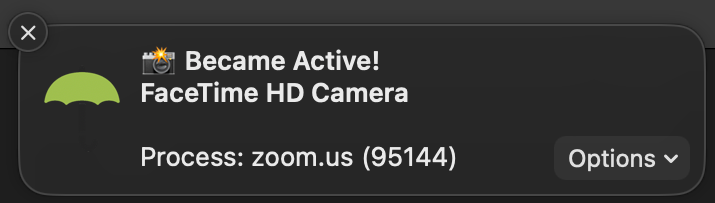

# OnCamera - an Elgato Key Light Automator

Detects webcam on/off events, triggering Elgato Key Lights to turn on/eff.  


## How does it work?
1. Computer with webcam has a listener to detect webcam on/off events.  In this case we are using Oversight on a Macbook Pro.
1. An express server is running locally to both set and get current status.
1. When webcam on/off events are detected a shell script is fired to update the local status through local express server api.
1. A remote machine on an interval requests the status from the api. 
1. If status == online then turn on lights.
1. If status == offline then turn off lights


## Why?
My use case involved a locked down work computer that:
1. Has the webcam
1. Cannot send data to local 10.0.0.x network, so it can't communicate direct with the Elgato Key Lights
1. Can receive data from the local 10.0.0.x network, so it can expose data for others to consume


## Requirements
1. A computer (runs the status api)
    1. with a webcam
    1. able to run an express server
    1. able to respond to rquests from the local network
    1. able to send/receive multicast traffic on the local network
1. A different computer (runs the watcher cli)
    1. able to connect via ip to the computer with the webcam
    1. able to send/receive multicast traffic on the local network
    1. able to connect via ip to the Elgato Lights
1. Elgato Key Lights
    1. able to send/receive multicast traffic on the local network
    1. able to receive requests from the local network


## Includes
- `Status cli` - for reacting to local webcam on/off events to set current status locally
- `Status api` - for exposing local status to remote watchers
- `Watcher cli` - for watching for webcam on/off events from remote machines


## Usage

### status-cli
This will be used on the Mac that has camera.  The cli script recieves camera on/off events in order to exposte them through `status-api`
1. Install OverSight for Mac: https://objective-see.org/products/oversight.html
1. Configure it to execute webcam-event.sh on webcam on/off events

1. Turn on something that uses your camera, ex: Facetime, Quicktime Player -> New Movie Recording, Teams, or Zoom, and notice the OverSight toast



### status-api
Expose the webcam status and receives updates to the status.  The status-cli script will update the status through this api, and the remote watcher-cli script will poll this api for status.
1. In the package root (`./packages/status-api`) install the correct version of node<br>`nvm install`
1. Install from the package root<br>`npm install`
1. Build `status-api`, again from the package root<br>`npm run build:api`
1. Run the status-api from `./packages/status-api`<br>`npm run start`

#### Optional - Run within pm2
1. Install pm2: https://www.npmjs.com/package/pm2<br>`npm install pm2 -g`
1. Navigate to `./packages/status-api`
1. Build `status-api`
1. Add to pm2<br>`pm2 start dist/index.js --name webcam-status-api`


### watcher-cli
Polls a remote status-api for current status and trigger changes to light status due to webcam stats.
1. In the package root (`./packges/watcher-cli`) install the correct version of node<br>`nvm install`
1. Install from the package root<br>`npm install`
1. Build watcher-cli, again from the package root<br>`npm run build:cli`
1. Run the watcher-cli from `./packages/watcher-cli`<br>`npm run start`

#### Optional - Run within pm2
1. Install pm2: https://www.npmjs.com/package/pm2<br>`npm install pm2 -g`
1. Navigate to `./packages/watcher-cli`
1. Build `watcher-cli`
1. Add to pm2<br>`pm2 start dist/index.js --name webcam-watcher-cli`

#### Optional - Local Development
1. Run with `npm run start:dev`

## Examples logs

### status-api


### watcher-cli
```
[2023-02-05T11:35:29.280] [INFO] default - Elgato Key Light MDNS Service Browser ready
[2023-02-05T11:35:29.288] [INFO] default - Webcam Status MDNS Service Browser ready
[2023-02-05T11:35:29.415] [INFO] default - Found a new Webcam Status device!
[2023-02-05T11:35:29.417] [INFO] default - _webcam_status._tcp.local 10.0.0.148 9124
[2023-02-05T11:35:29.632] [INFO] default - Found a new Elgato Key Light device!
[2023-02-05T11:35:29.633] [INFO] default - elgato-key-light-air-da7f.local 10.0.0.39 9123
[2023-02-05T11:35:29.661] [INFO] default - Found a new Elgato Key Light device!
[2023-02-05T11:35:29.662] [INFO] default - elgato-key-light-air-fc37.local 10.0.0.38 9123
```